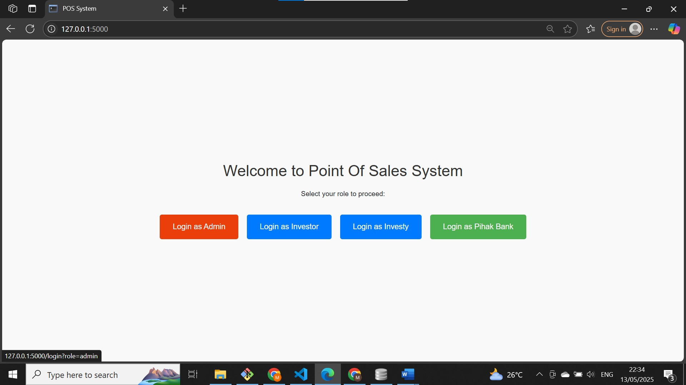
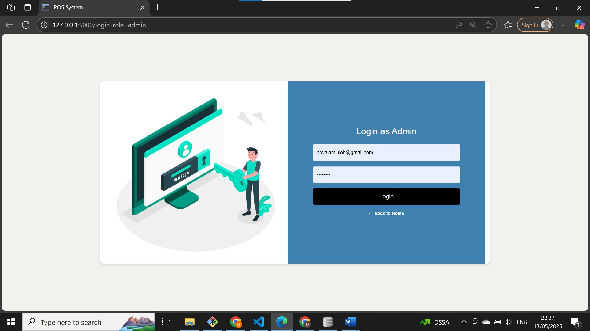
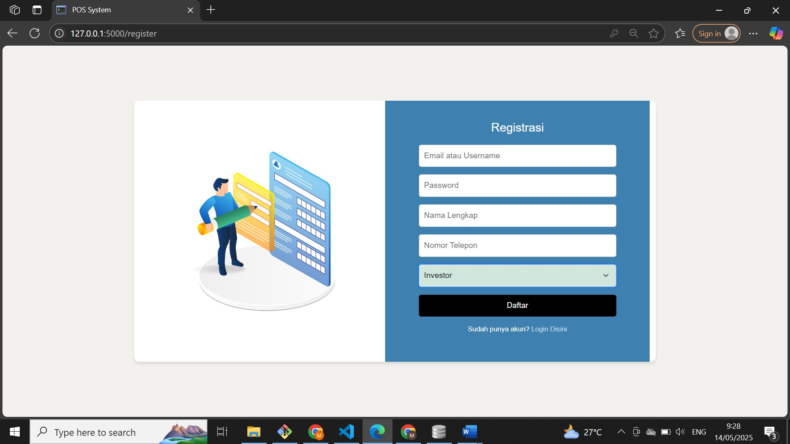
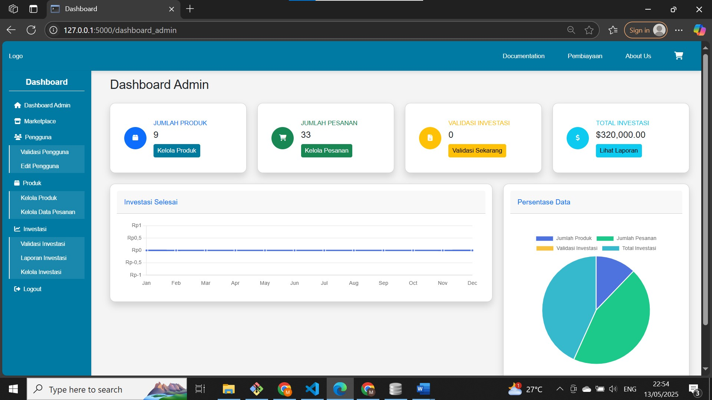
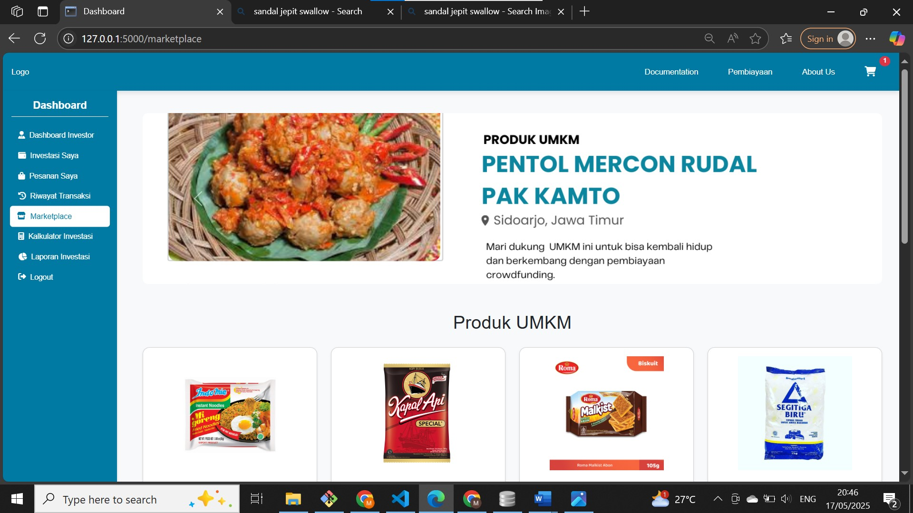
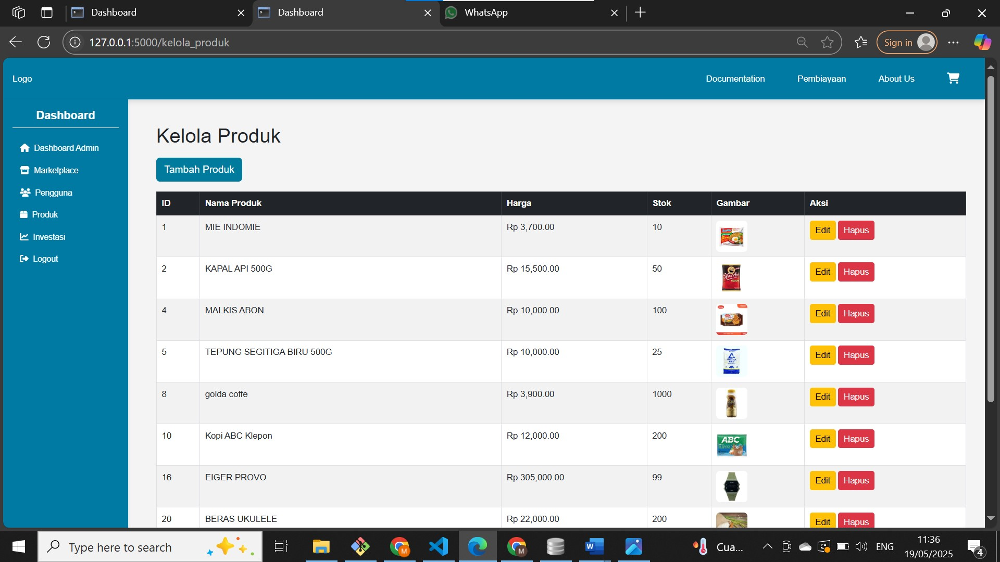
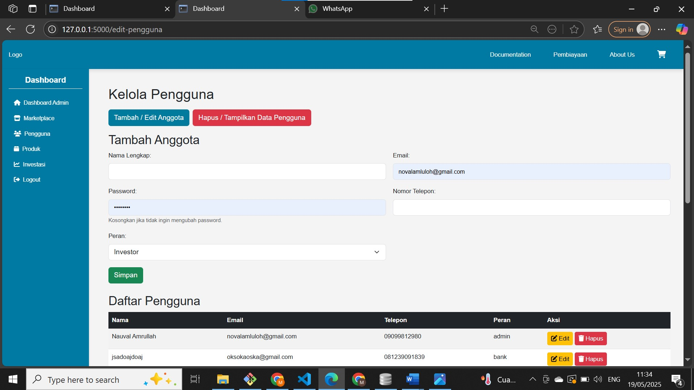
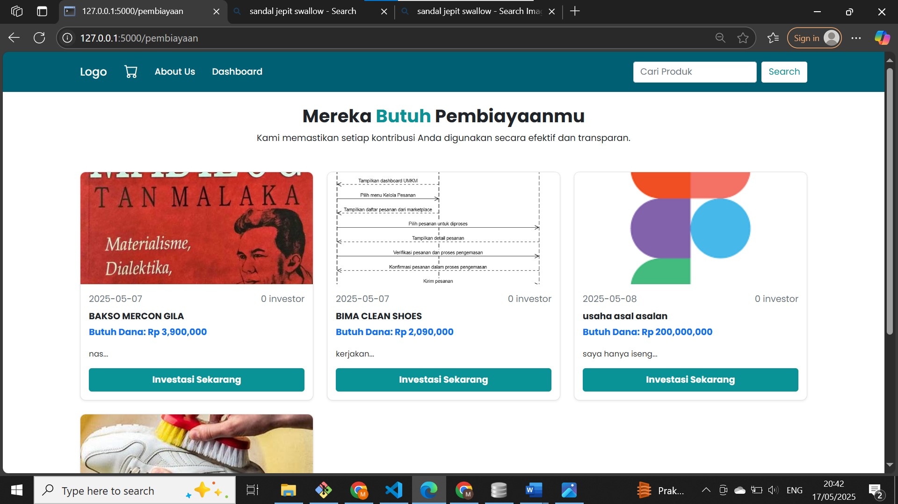
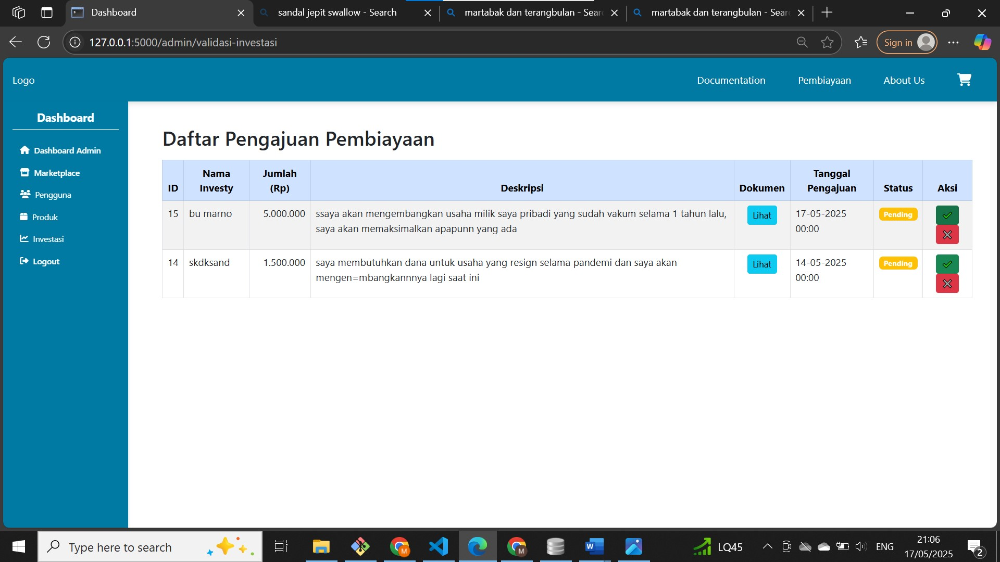

# Middleware POS System

Marketplace & Crowdfunding Platform for UMKM

## Description

A web-based application developed using Flask and SQLite that integrates marketplace and crowdfunding services. The platform connects UMKM, Investors, Banks, and Administrators through a centralized system for product management, order processing, investment management, and funding validation.

---

## Features

### User Management
- Multi-role Authentication
  - Admin
  - Investor
  - UMKM
  - Bank
- User Registration
- User Management
- Profile Management

### Marketplace
- Product Management
- Product Catalog
- Shopping Cart
- Order Management

### Crowdfunding
- Investment Management
- Funding Submission
- Funding Validation
- Investment Monitoring

### Dashboard & Reporting
- Admin Dashboard
- Investment Statistics
- Product Statistics
- Order Statistics
- Financial Reports

---

## Tech Stack

### Backend
- Python
- Flask
- SQLite

### Frontend
- HTML
- CSS
- JavaScript
- Bootstrap

---

## Screenshots

### Landing Page

---

### Login Page

---

### Registration Page

---

### Admin Dashboard

---

### Marketplace

---

### Product Management

---

### User Management

---

### Crowdfunding Page

---

### Investment Validation

GAMBAR MASIH BELUM SEMUANYA DI UPLOAD, KUJUNGI WEB | 
https://b9nauval.ijabqabul.id/
untuk memperoleh akses penuh dengan mendaftar dengan akun dummy
---

## System Roles

### Admin
- Manage Users
- Manage Products
- Validate Investments
- Monitor System Activities

### Investor
- View Funding Opportunities
- Invest in UMKM Projects
- Monitor Investments

### UMKM
- Submit Funding Requests
- Manage Products
- Process Orders

### Bank
- Review Funding Applications
- Funding Verification

---

## Project Highlights

- Multi-role Authentication System
- Marketplace Integration
- Crowdfunding Platform
- Investment Validation Workflow
- Dashboard Analytics
- Product & User Management
- Responsive Web Interface

---

## Author

**Nauval Amrullah**

IT Support | Junior Web Developer

GitHub:
https://github.com/nauvalamrullah

LinkedIn:
https://www.linkedin.com/in/nauval-amrullah/
